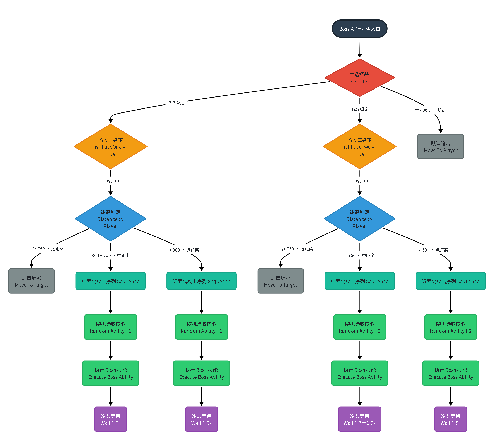

Boss战Demo战斗设计文档
1. 核心设计理念
通过 两阶段转换 改变战斗节奏，迫使玩家在不同阶段采用不同的应对策略。
- 一阶段：Boss 为近战压制型，使用基础挥砍和范围技能，给玩家学习闪避和防御窗口。
- 二阶段：Boss 进入狂暴状态，移动速度提升，攻击欲望增强，并解锁新的高威胁招式。
玩家拥有 连招、防御、翻滚 三种核心应对手段，三者之间相互制约，形成战斗循环。
2. Boss 两阶段设计
| 对比维度 | 一阶段 | 二阶段 |
|----------|--------|--------|
| 移动速度 | 走路 | 跑步 |
| 攻击后喘息 | 1.5秒 | 更短（攻击欲望更强） |
| 伤害变化 | 基准 | 提升30% |
| 转身表现 | 一阶段转身动画 | 二阶段转身动画（更狂野） |
| 视觉表现 | 手持棒子扛在肩上 | 手持棒子拖地，姿态更低更具侵略性 |
3. Boss 技能表
一阶段技能
| 技能名称 | 前摇 | 判定窗口 | 后摇 | 伤害 | 距离条件 | 特殊效果 |
|----------|------|----------|------|------|----------|----------|
| 左挥砍 | 0.8s | 0.2s | 1.5s | 基准 | 近距离 | 普通命中 |
| 右挥砍 | 0.8s | 0.2s | 1.5s | 基准 | 近距离 | 普通命中 |
| 旋转挥砍 | 1.0s | 持续判定 | 1.8s | 基准/次 | 中距离 | 范围持续伤害，可多次命中 |
| 跳劈 | 1.2s | 落地瞬间 | 2.0s | 高伤害 | 中距离 | 圆形范围伤害，击倒玩家 |
二阶段技能
| 技能名称 | 前摇 | 判定窗口 | 后摇 | 伤害 | 距离条件 | 特殊效果 |
|----------|------|----------|------|------|----------|----------|
| 左挥砍 | 更快 | 0.2s | 更短 | ×1.3 | 近距离 | 普通命中 |
| 右挥砍 | 更快 | 0.2s | 更短 | ×1.3 | 近距离 | 普通命中 |
| 重砸 | 1.2s | 0.2s | 2.0s | ×1.3 | 近距离 | 高伤害 |
| 双连砍 | 0.6s/0.4s | 各0.15s | 1.8s | 两次伤害×1.3 | 近距离 | 两段连击 |
4. Boss AI 行为树
4.1 行为树总览

4.2 转身逻辑说明
Boss 的转身 不在行为树中直接处理，而是由 BossAIController 每帧检测：
- 当 Boss 不在攻击状态，且与玩家夹角 > 45° 时，触发 GA_TurnToFace。
- GA_TurnToFace 根据夹角选择 45°、90°、135°、180° 转身动画（一阶段和二阶段使用不同动画组）。
- 转身动画使用根运动，动画结束后强制精准朝向玩家。
这样设计的好处：
- 转身不影响行为树的主干逻辑。
- 转身动画可以独立打磨，不干扰攻击和移动分支。
- 避免行为树过于复杂，保持清晰。
5. 玩家操作与应对手段
| 操作 | 功能 | 限制 |
|------|------|------|
| 左键连招 | 四段攻击，支持预输入（结束前0.5s到结束后0.3s） | 攻击中不能防御或翻滚 |
| 右键防御 | 正面减伤70%，背面无效 | 防御时无法移动、攻击、翻滚 |
| 翻滚闪避 | 基于镜头方向，翻滚期间无敌 | 攻击或防御中不可用 |
6. 受击反馈设计
- 普通攻击命中：根据攻击方向播放前/后/左/右四个方向的摇晃蒙太奇。
- 跳劈命中：根据玩家面朝方向播放正面或背面倒地蒙太奇。倒地动画播放完毕后自动站起，无额外硬直。
- 防御成功：不播放受击动画，播放盾牌格挡音效，伤害减免70%。
